# Navigating an imperfect Eden.

(click/tap to zoom)
[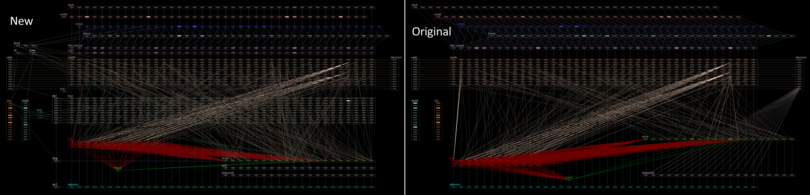](res/pic_brains_vert.png)

The neural net running C3/DS brains is a fascinating piece of work; elegant, inspired, economical, ambitious. But it does have some serious implementation limitations. Here I'd like to share some original research, and some long overdue fixes.

Grab the latest version from the [Releases](https://github.com/JonathanDotCel/unlost_genome/releases) section.  
They're available in all of your favourite flavours, including but limited to: C1INDS Pixie, with full .GNO documentation.

## Ethos
- robust to environmental issues & errors
- generalise for adaptability
- fully document and verify every change
- minimal chemical changes
- minimal opinionated changes

Environments are unpredictable & inconsistent, but we can fix the brains that navigate them.

## Fixes
- Senility is completely eliminated
- Clustering is limited & transient
- Dendrites established almost immediately, allows learning sooner
- Improved/Replaced crowding mechanisms
- Fault tolerant defensive infrastructure
- Anti habituation mechanisms for repeated behaviour (+ feedback loops)
- Reintroduce missing stimuli reinforcement
- Add various missing navigation instincts
- Slight parental/sibling grouping while young
- Expanded dendrite count, reduced superflous dendrite connections
- Tired/Rest cycle fixes
- Inbreeding inhibitor
- Exploration is encouraged

No more elevator cults, no more fridge goblins, no more dying right next to a pile of food.

Alpha preview, feedback welcome.

# 5 Minute Primer

Let's make this a quick read so that the rest of the documentation will make sense.  
Feel free to skip it, but it will help explain where theory and messy reality diverge.

Loosely speaking, the brain is a bit like a pair of regular feed forward perceptrons smushed together (scientific term). With one orientated vertically, one horizontally, meeting in the middle at the `COMB` (combination) lobe.

### Primer: Basic layout

(click/tap to zoom)
[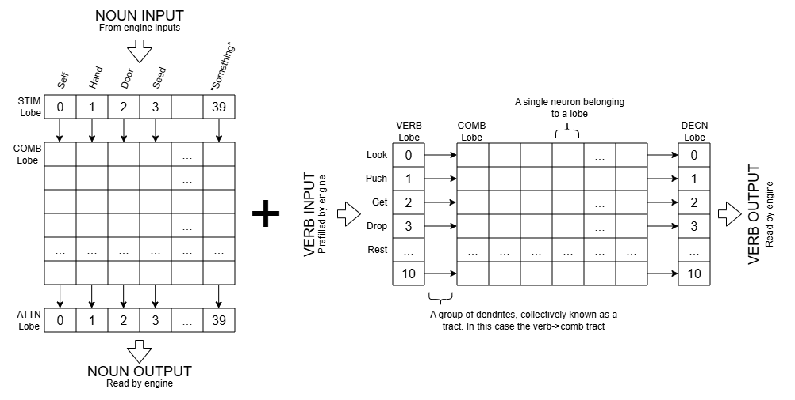](res/pic_primer_horz.png)

`STIM -> COMB -> ATTN`  
This STIM lobe is sourced from engine inputs (nouns/objects/smells)  
These are fed into neurons in the same *column* in the COMB lobe.  
Then fed back out to the ATTN lobe.

`VERB -> COMB -> ATTN`  
The VERB lobe is filled directly by engine inputs  
These are fed into neurons in the same *row* in the COMB lobe.  
Then fed back out to the DECN lobe.

For inputs (STIM/VERB) there can be multiple various-strength inputs.  
For outputs (ATTN/DECN) the engine is expecting a single dominant output ("one-hot" encoding).


### Primer: Combined Inputs/Outputs:

Combining nouns and verbs, we get:
[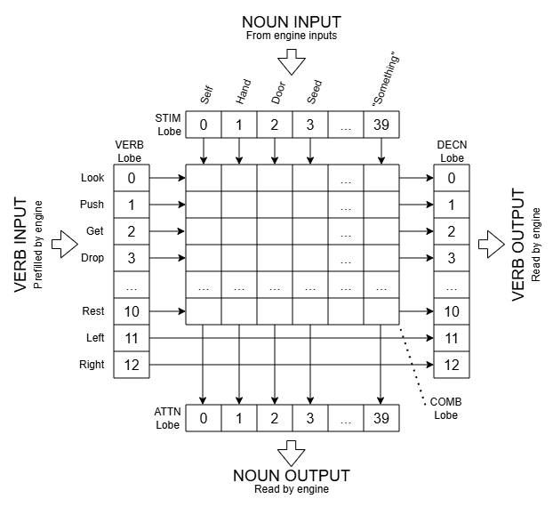](res/pic_primer_merged.png)

Everything meeting in the COMB lobe, where decisions are made.

You might've noticed a couple of extra verbs have snuck in; LEFT and RIGHT. They don't go through the COMB lobe, meaning they can't be trained, and so present a bit of a nuissance overall, requring special cases. Let's ignore them for now.


### Primer: Learning:

Last diagram for now:

[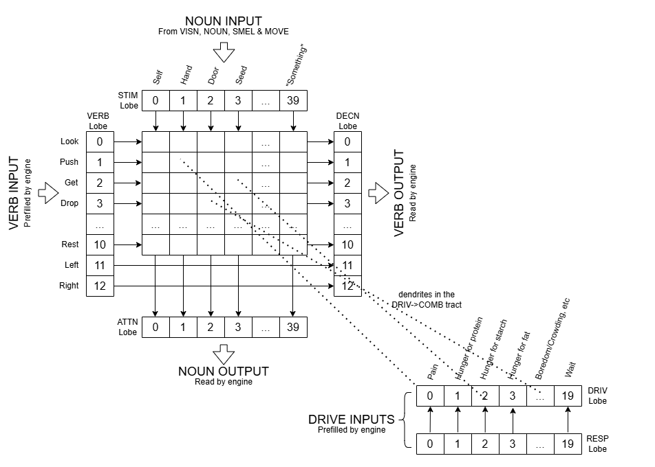](res/pic_primer_with_drives.png)

The `DRIV` (drives) lobe contains the raw (ish) chemical values of various drives: hunger, boredom, crowdedness, loneliness, anger, etc. It is pre-filled by the engine on every update.

(We'll cover RESP in a sec)

### Primer: Memory Recall & Affordance:

The DRIV->COMB tract, acts as both memory recall and storage (learning).

At birth, dendrites are semi randomly connected from the DRIV lobe to the COMB lobe.
During sleep (especially the first sleep) instincts are then also converted to dendrite connections.  

These dendrites have two main factors: 

- `WEIGHT:` How much influence this connection has, e.g.: `hunger for starch` -> `eat seed`  

- `STRENGTH:` Think of this as longevity. If it becomes weak (due to negative reinforcement), the dendrite connection may be dropped and reused for something else ("dendrite migration"), especially during sleep.

Their exact relationship wil be explained in a later section, but for now, it is roughly as follows:

[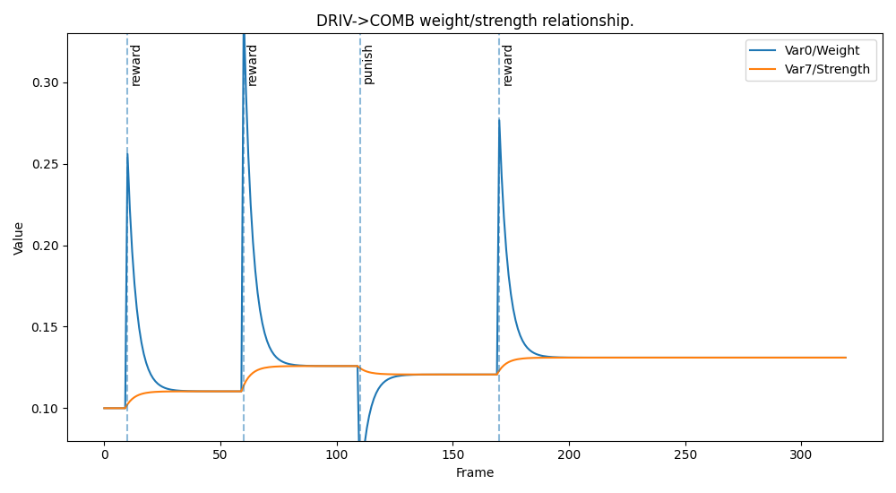](res/pic_graph_rewardpunish.png)  


Decision making:

- I can see/smell a seed. 
- The COMB neuron crossing `get` and `seed` is stimulated.
- Optional: I also heard the word `seed`: add a little more input to that COMB lobe neuron.
- The `hunger for starch` neuron in DRIV is lit up: "I'm hungry".
- The DRIV->COMB dendrite connecting `hunger for starch -> get seed` adds its weight to that COMB lobe neuron as well.  

The neuron for "get seed" now has an even higher input from the DRIV->COMB tract's influence, and wins.  
Now "seed" is sent to the NOUN lobe, and "get" is sent to the DECN lobe.

- If there were no seeds present, "get seed" would not have won.  
- If there was no hunger, "get seed" might also not have won.  
- If there was a stronger drive for e.g. boredom, that might have won.  
- If the dendrite had died/migrated, "get seed" would likely not win (but may, randomly).

In this way the DRIV->COMB stim handles affordance: i.e. it is more beneficial to stimulate "eat seed" if we can actually see a seed, and it is more necessary if we have a high hunger drive.

This is an example of a beneficial connection. Other less useful connections like:  
 `boredom -> drop door` or `pain -> push hand`  
 make no sense and so are unlikely to be positively reinforced. (In theory).  

The "get seed", "drop door" and "push hand" examples are shown in the complete diagram above.

### Primer: Learning & Credit Asssignment:

Learning is much the same, except for dendrite weights being adjusted in response to stimulus genes.

The RESP (response) lobe records changes in drive chemicals, linked to learning events.  
If a stimulus gene like `i pushed a button` is triggered, causing `reduce boredom by 0.2`, then the RESP lobe will, for *one frame* be pre-filled with the value `-0.2` (as long as it is not marked "silent").

> **Note:**  
> Each neuron has 8 programmable state vars. This means the DRIV lobe neurons can each contain the raw drive value (hunger, anger, etc) *and* however much it just changed in response to a stim (like "push toy" or "eat seed" via RESP->DRIV tract).   
It may be beneficial to ignore the RESP lobe for now and think of the DRIV lobe has having both (the raw value, and the learnable change).

The loop for learning:
- I just ate a seed.
- The COMB neuron crossing "eat" and "seed" is now "susceptable" for a few seconds.
- The stimulus gene for "ate a seed" triggers, it reduces "hunger for starch" by `0.2`.
- The creature is immediately less hungry for starch.
- RESP's neuron for "hunger for starch" flashes `-0.2` for one frame.
- The DRIV->COMB tract dendrites read the change of `-0.2`.
- The DRIV->COMB tract checks if it's connected to something which is susceptable.
- In this case, it is: there's one going from "hunger from starch" to "eat seed".
- The dendrite adjusts its own weight, this is a positive interaction.
- Next time, "eat seed when hunger for starch" is more likely to be chosen.

Same thing for negative instincts like "don't eat random weeds, please", in which case, the dendrite would take on a negative weight, in hopes of discouraging repeats. This would *reduce* the input on COMB's "eat weed" neuron.

Reward/Punishment (Tickle/Slap) is very similar:
- The `DRIV->COMB` tract checks for the presence of `Reward` (chem 204) or `Punishment` (chem 205).
- Every susceptable (recently active) COMB neuron is positively or negatively reinforced.   

Yes, *every* susceptable (recently active) COMB neuron is positively or negatively reinforced.

With automatic training from stimulus genes, there is at least a weak semblance of credit assignment or a causal link (e.g. pushed button, reduced boredom), but when manually tickling/slapping there is not.

To reinterate:
- `INSTINCTS:` determine which dendrites will be connected from DRIV->COMB during sleep, and their initial weights & strengths.

- `STIMULI:` determine the actual outcome of builtin actions the creature has performed: what action to take in response, what chemicals to release, and whether those chemicals are trainable (like boredom/hunger).

So the following situations are possible:
- An instinct exists for: `boredom -> push toy`. That dendrite will be connected during sleep, with the default weight + strength defined in the instinct gene.

- NO instinct exists for: `angry -> eat elevator`. But it *might* be randomly connected during sleep anyway.

- An instinct can exist without the stimuli to train it. It will continue to have influence in decision making, but won't have a stim to directly reinforce positively or negatively. Except due to errors. (Spoilers).

- A stimulus can exist without the underlying instinct. For example if there were no instincts to push buttons, "boredom -> push button" would still reduce boredom. It would just not have any DRIV->COMB dendrite to train, unless one was randomly connected during sleep.

### Primer: Sleeping

Finally, sleeping.

As mentioned, sleeping is where instincts are converted to DRIV->COMB dendrites, and where weak dendrites migrate but there is also a REM cycle where dreaming happens.  
While sleeping, the engine simulates various inputs to the input lobes, including DRIV. The creature is essentially dreaming and pre-training dendrite weights.

> **Note**:  
> While VERB lobe is prefilled directly by the engine, the STIM lobe is fed from 4 sources:
> - NOUN: volume of spoken nouns
> - VISN: distance to visible objects & smells
> - SMEL: distance to smellable objects & smells (longer range)
> - MOVE: something moved in VISN
>
> The first 3 are filled by the engine directly (pure input lobes), while the MOVE lobe compares the VISN lobe's current value with the previous value, to provide a slight bias towards moving objects. All 4 are mixed into the STIM lobe.  
> This group is largely unproblematic, but it is useful to know that these lobes exist.

That's the long & short of it. I've glossed over one or two things, but it should be enough for the rest of the document.  
As you might imagine at this point, DRIV->COMB is the source of most of the issues.

# Problem #1: Reward, punishment, and senility.

As mentioned, the `DRIV->COMB` tract checks for the presence of `Reward` (chem 204) or `Punishment` (chem 205).
There's another related signaling chemical: `Disappointment` (chem 198).

This works largely as you'd expect: if something disappointing happens, maybe it's a good idea to try something else. But let's take a look at gene `388`: the Disappointment stimulus.

[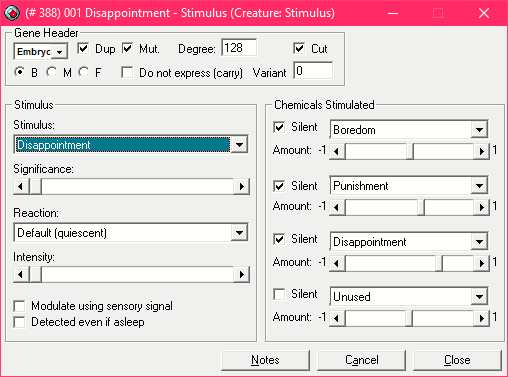](res/pic_gene_388_disappointment.png)

As expected, if something disappointing happens, a shot of Disappointment is released into the bloodstream, with a small amount of Boredom, likely to encourge trying something else.

The issue lies in that Punishment chem.
Any recently active neuron in the COMB lobe will be susceptable. This can include large groups, and even categories of them. Here's the comb lobe of a norn relaxing in the C1INDS garden:

[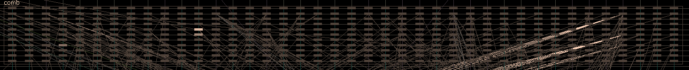](res/pic_comb_susceptability.png)

The highlighted neurons are showing those with nonzero Var3/Susceptability:
- 283: "Hit Seed" (feint, on the left)
- 171: "Eat Food" (brightest)
- 211: "Pull Food" (below "eat food")

Let's say "hit food", being invalid were to trigger a disappointment stim gene. In reality what triggers disappointment varies a little by object/agent, but we'll cover that in a bit. If the norn becomes disappointed by "hit food" (or any other disappointing event), the following will happen:

[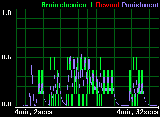](res/pic_chems_disappointment_punishment.png)

- quick spike of disappointment
- a prolonged spell where there is punishment in the bloodstream.  
Note: "Brain Chemical 1" is an alternate name for "Disappointment"

All three of those neurons will be negatively reinforced as long as they are susceptable (they are) and there is Punishment in the blood stream (there is).   
So A norn hitting food may learn that "eat seed" is not a great idea, this is one of many valid examples.

So to simplify: Punishment, by way of the disappointment stimulus, can untrain good instincts, causing the dendrite for that instinct to vanish, and migrate.

Great, can we just tweak gene 388 and carry on?  
Unfortunately no.

# Problem #2: Repetitive behaviours & senility

Let's take a look at a really common, but utterly devastating example: 

[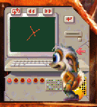](res/pic_learning_computer.png)  
(this norn is a paid actor, he's fine)

Our little friend here has wandered up to the learning computer, carrying a lemon for later.

- The norn is bored.
- Since the learning computer is a toy, he pushes it to reduce boredom.
- He keeps pushing it.
- The learning computer teaches him a few things.
- After a few pushes, the computer fires the disappointment stim: "stop using me please".
- The norn is punished for this.
- "push toy" is negatively reinforced, just a bit for now.
- He was just thinking about that lemon, fruit based actions are now negatively reinforced.
- On top of that, the disappointment stim now fires a shot of boredom into the mix.
- Pusing the computer looks like a good way to deal with this boredom...

This is one silly, trivial example, and in isolation would have next to no effect.
But think of the wider picture, what else can cause the disappointment stim to fire?

This is not an exhaustive list, but it's enough to demonstrate how wide spread the issue is:
- Odd actions like "hit food" or "eat toy".
- Trying to reach something through a semi-permiable wall [1].
- Trying to reach something hanging off an edge.
- Trying to grab something on a steep slope.
- Walking into a wall.
- Walking onto a steep but valid slope (C3 hub area, edges).
- Losing focus on something when carried in a lift (can't reach it).
- Repeatedly banging the C1INDS learning computer.
- Picking up a norn while it's in the middle of something.
- Pointer slapped me.
- Unexplained acts of god.

[1] Room 64 in C1InDS for example

While lethal actions like "I grabbed a bee, ate the bee, the bee poisoned me, and I died" do not.

Now imagine this over several hours.

Every time your creature tries a new action, there's a chance something else will be detrained.  
A wall is bumped, while eating.  
A slightly mistimed slap or tickle.   
Your creature tries to grab food as the lift is called up.  
After a while, all the good actions are looking like bad ideas.
Your norn tries whatever's left.
"Hit food", "Pull door", etc; actions which will *accelerate* the process.  
Later, instincts like "eat food" can be completely forgotten.  
Instincts like "eat when hungry" can migrate around the 1h40 mark, and may never return.  

It's not one thing. It's a series of constant mixed messages. A slow but continual degradation of instincts and learning from the moment a creature is born.

Once again, Great, can we just tweak gene 388 and carry on?  
Unfortunately no.

# Problem #2 Missing stimuli

Let's say we tweak gene 388 (Disappointment stim) to remove only the Punishment part, and re-run our test.

- A norn is born near the C1INDS learning computer.
- The norn is bored, and so pushes the computer.
- The computer is missing the CAOS stim for "played with toy".
- The norn never receives the "played with toy" stim, so boredom doesn't go down.
- The norn receives the "disappointment" stim though, which increases boredom.
- The norn is bored and so pushes the computer.
- You see where this is going..

`"Environments are unpredictable & inconsistent, but we can fix the brains that navigate them."`

The norns don't posess any sort of mechanism to to deal with unexpected interactions, handle errors, etc. We need *generalised* mechanism to handle this sort of error.

The existing disappointment stim used to do that, and its architecture is even defensible, in an odd, roundabout way:

As mentioned, the `DRIV->COMB` tract dendrites have 2 main values:
- `Var 1/Weight:` The dendrite's influence
- `Var 7/Strength:` The dendrite's longevity

And the same graph showing their relationship . The exact values are illustrative, but the concept is the same.

[](res/pic_graph_rewardpunish.png)  


Let's imagine `hunger for starch -> eat seed` again.  

When the norn is born, the dendrite could be initialised with both strength and weight at `0.1`: not overly strong, but enough to suggest that eating is a good plan.  
I.e. In a range of -1 to 1, where 1 is "great idea" and -1 is "terrible idea".

```
Weight  : 0.1  
Strength: 0.1
```

If the norn eats a seed, the Weight gets a small boost of let's say 0.2. 
Leaving our dendrite looking like:
```
Weight:   0.3  <-- the weight is affected
Strength: 0.1
```

The weight and strength are pulled towards eachother over time:  
Weight moves quickly towards strength (the `Short Term Relax Rate`)  
Strength moves more slowly towards weight (the `Long Term Relax Rate`)

So over the course of maybe 10 seconds:  

`Weight` will be dropping `quickly towards Strength`  
`Strength` will be moving very `slowly towards Weight`  

In the end the strength might have grown by only a tiny amount, maybe gaining 0.01 and settling on 0.11.
The two will meet at this point.
```
Weight:   0.11  <-- brief spike, then return
Strength: 0.11  <-- grown a tiny bit
```

Immediatelty after the norn eats again:
```
Weight  : 0.31  <-- a boost of 0.2
Strength: 0.11  <-- hasn't moved yet
```

But after a few seconds:
```
Weight:   0.12  <-- brief spike, then return
Strength: 0.12  <-- grew a tiny bit
```

Weight will peak and return close to where it was.  
Strength gains a tiny bit in the time it takes that to happen.

So under perfect conditions, an agent like the learning computer triggering disappointment makes sense.
It would temporarily reduce the "bored -> push toy" dendrite's weight.
- The weight (influence) would drop short term.
- Strength (longevity) would drop a tiny bit
- But ultimately they would return to *more or less* the same values

Obviously now we know that between punishment/disappointment/missing stims, this can have more of a runaway effect. I'm not singling out the learning computer here, nor the original genomes (they worked with what they had) but we can fix this, and it would be good to.

# Fix #1: Gene 388, the Disappointment Stim
Gene 388: Disappointment stim.

We rip out the Punishment and Boredom parts.
It now produces only Chemical 198: Disappointment.

This elimimates senility.  
Check in on a highlander after 30 hours; the brain will not only be fine, it is often far more fine-tuned,  with useless dendrite connections completely pruned. You geta very streamlined, hyper-focused brain.

# Fix #2: SUPR lobe & Habitual behaviours

As we've discussed, Fix #1 comes with a downside: norns will use the learning computer (and other agents) indefinitely, because the mechanism to stop them is gone. But this is a great opportunity, as the fix addresses several behaviours including wall-banging.

Enter the `SUPR` (suppression) lobe.

[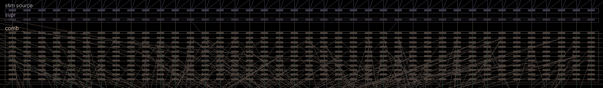](res/pic_lobes_supr.png)  

The SUPR lobe sits between the STIM and COMB lobes, essentially replacing the `STIM->COMB` tract, and can intercept nouns entering the COMB lobe.

The ATTN lobe loops back into SUPR, and lets it know what the norn is actively focused on.  
After too much time focused on one noun/category, the comb lobe triggers and temporarily inhibits that particular noun (spoken, visual, or smell). E.g. `stop pushing that lift button, it's time to get in the lift.`

So for example with SUPR neuron 26 "elevator"/"lift":
- If the norn is focused on a lift, the `trigger` timer will count up towards `1.0` over several seconds.
- If the norn changes focus, it will relax back to `0.0` without ever triggering.
- If the trigger timer *does* reach 1.0, then the `latch` timer activates. It has become "latched".
- Anything going through this neuron is now *almost* muted
- The latch timer now counts back towards zero, gradually unmuting the neuron.

Not all nouns are included in the SUPR lobe. It is safe enough to include food, since norns no longer forget how to eat, but we want to balance healthy clustering with unhealthy clustering. Inhibited nouns include:

```
✅ Inhibited
❌ Not inhibited


❌ 00 Self
❌ 01 Hand
✅ 02 Door
✅ 03 Seed
✅ 04 Plant
✅ 05 Weed
✅ 06 Leaf
✅ 07 Flower
✅ 08 Fruit
✅ 09 Manky
✅ 10 Detritus
❌ 11 Food
✅ 12 Button
❌ 13 Bug
❌ 14 Pest
✅ 15 Critter
❌ 16 Beast
❌ 17 Nest
❌ 18 Animal egg
❌ 19 Weather
❌ 20 Bad
✅ 21 Toy [1]
❌ 22 Incubator
❌ 23 Dispenser [2]
✅ 24 Tool
❌ 25 Potion
✅ 26 Elevator
✅ 27 Teleporter
✅ 28 Machinery
❌ 29 Creature Egg
✅ 30 Norn Home [3]
❌ 31 Grendel Home
❌ 32 Ettin Home
✅ 33 Gadget
✅ 34 Portal
✅ 35 vehicle
❌ 36 Norn
❌ 37 Grendel
❌ 38 Ettin
❌ 39 Something
+
✅ elevator -> button [4]
✅ button -> elevator [5]

[1]: Toys take ~3x longer to inhbit, to allow longer play times.
[2]: Dispensers may dispense food, toys, anything. So inhibit them, but only weakly.
[3]: The Norn Home allows a sort of social hub for egg laying, near sources of food.
[4]: Elevators are cross wired to contribute to the timer for buttons, since there's no need to use a button immediately after leaving an elevator.
[5]: Buttons contribute to elevator timers, but only very weakly, to discourage overcrowding, but prevent "elevator" being inhibited by repeated "button" mashing.
```

The SUPR lobe has some useful behaviours built in:

### SUPR: Repeated abuse

The first time the SUPR lobe activates for any given noun/object, the inhbit time will only be around 3-4 seconds. On the second, third and fourth activations, this will rise to around 15 seconds. 
After a minute or so, this will slowly drop back to around 3-4 seconds if it hasn't been triggered.

Since we're missing multi step behaviours this helps with lifts and vehicles in general. 
E.g. a norn should be encouraged to use a lift when bored, lonely, or in pain, but also to get out of the lift afterwards and seek out a toy, company, etc.

### SUPR: Proximity

A norn may be focused on something quite a distance away. Especially as a baby, where it may take 5-10 seconds to walk to the target. The SUPR lobe's trigger timer is based on distance.

The formula used is an inverse ease-out:
```
y = 1-(1-x);
```
Similar to the tail end of a sigmoid/squash function:

[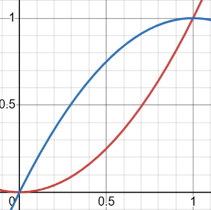](res/pic_graph_easeout.png)  
Pictured here in Blue. Vs a regular `y=x^2` in Red.

This feels natural and gives norns some time to approach targets.

> **Note:**  
The DETL lobe also contains a neuron "it is this close to me", with inverted distances which are easier to work with, but the range is comparatively limited, so the STIM lobe must be used here.

### SUPR: Failsafe

There is a small, nominal value applied to help deal with phantom objects & smells.  
For example room 1218 in C1INDS contains a phantom "Food" smell. After chasing things like that for a while, norns should give up.


### SUPR: Easy Reusability

The SUPR lobe's trigger timer "input" is pre-set to 0 on Slot 1 of every update. This means any lobe or tract after slot 1 can "add and store" into the counter to add new behaviours, but there is no requirement for any specific lobe to clear the value. More on this later. 

# Problem #3 SUPR Lobe Activation Time and Redundancy.

We want a hardy genome with multiple levels of redundancy to unexpected & inconsistent input.

If for example a norn is trying to "push lift" (go up) when it is already at the top, and they need to "pull lift" (go down), then the SUPR lobe may activate before they find the right action, inhibiting elevators for a while.

This can be biased with Up/Down drives, but those are inconsistent and sometimes the goal is just "anywhere but here".

Another example might be a norn trying something new: they may spend 8 seconds trying to "pull machine", "express machine", "rest machine" with no luck, inhibiting "machine" temporarily before getting the beneficial outcome. E.g. due to randoml sleep-assigned dendrites which suggest that "express machine" helps with anger.

Yes, instincts will largely cover this, and yes, senility is gone, but this hints at larger engine limitations. We can't hope to cover every possible set of quirks, edge cases, glitches, etc in every metaroom. As in nature, we must generalise.

Enter the `FCUS` (focus) lobe.

[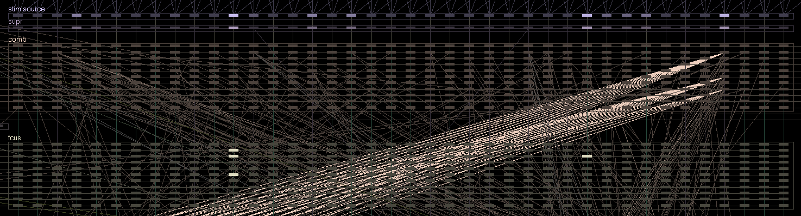](res/pic_lobes_fcus.png)  

The FCUS lobe works in tandem with and almost exactly like the SUPR lobe, except that it operates on individual verb/noun pairs, instead of whole noun categories.  

- The SUPR lobe can inhibit "norn" or "critter" for a while.
- The FCUS lobe can specifically inhibit "push norn", "eat norn", "rest critter" for a while.

The FCUS lobe inhibits specific actions about 1/3 faster than the SUPR lobe. This allows a norn to try "eat lift" (wrong), "push lift" (wrong), "pull lift" (correct) before "lift" is completely inhibited.

It reads the output from the COMB lobe, and modifies it before it is sent to ATTN and DECN for the engine to read. This required a reordering of nearly every brain lobe and tract, but opens up a lot of flexibility.

Like the SUPR lobe, the trigger timer is distance-based with failsafes, and has some exceptions:

- "approach" is weakly inhibited to allow time to reach objects (including "norn home").
- "push toy" has the same relaxed activation timer as SUPR.

For both lobes, this is accomplished by a tract modifying the apparent distance to the target before the SUPR/FCUS lobes read it. E.g. if we pretend the object is twice as far away, then the timer takes roughly twice as long to activate. If we zero out the distance, then the timer never activates.


In the above image, the following neurons are highlighted, showing that these actions were recently inhibited by the FCUS lobe:

```
51:  "push food"
91:  "get food"
211: "pull food"
109: "get creature egg"
```

But unlike the DRIV->COMB negative reinforcement, it is temporary and short-lived.

> **Note:**  
Exact mechanisms and variable usage are documented in the .GNO file in excrutiating detail.

> **Note:**  
Gene 407: "Walked into a wall" does not fire consistently. It may be fixable via CAOS scripts, but it fixed by the SUPR and FCUS lobes.

# Problem #4: Relaxation rates:

As mentioned in the DRIV->COMB section, reinforcement events **add** to a dendrite's weight value.

Caveat: sometimes it **subtracts** for a positive event.

This tends to happen when the neuron already has a high weight, above 0.24, causing the value to drop, weakening the dendrite's strength over time.

Randomly, eventually, the value will grow past 0.24 again, towards 0.4, 0.5, 0.6, etc.

This could be a deliberate remant of the system increasing weight/strength after positive events, but temporarily de-emphasising the output to prevent habitual behaviour.

As such a minor modification was made to the Update rule, governing automatic training:

- `flip around 1` is now `flip around 0.6251`

This helps prevent the weight dipping below 0 on positive reinforcement events. It may dip to ~0.24, but not below.

# Problem #5: Insticts at birth.

There's an uneasy truth here:
Anything you train before the first sleep is likely in vain.

- All DRIV->COMB dendrites before the first sleep are completely random.
- The actual connections like "eat food while hungry" are trained during the first sleep.
- Thus "eat food when hungry" is unlikely to be trained.
- Giving the norn an encouraging tickle is likely reinforcing the wrong thing.
- Slapping the norn could be untraining the one good instinct they have.

The norn may well learn short-term, i.e. over the course of a few seconds as the neuron responsible will have a residual output, and susceptability. But there's no long term learning.

Enter the `INST` (instinct) lobe:

[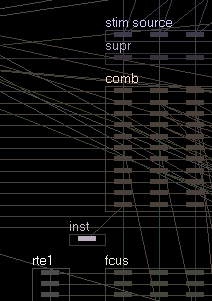](res/pic_lobes_inst.png)  

It's a single-neuron lobe which, at birth, injects a massive amount of sleepiness, and directly stimulates "rest self" in the comb lobe. Baby norns will immediately sleep, forming all of the required dendrite connections.

This is timed to accomodate all of the new instincts in the Unlost Genome, so if you do add any more instincts, make sure to check that creatures sleep long enough at birth. The following CAOS command will show how many instincts are yet to be converted to dendrites. You can watch it count down to zero as they sleep.
```c
targ norn outv ins#
```

Ultimately, sleeping right after birth feels very baby mammal-coded and natural, and means that learning can begin right away. Either way your choices are:

- They're born, don't sleep, and weird things are reinforced.  
or
- They're born, take a power nap, biiiig stretch, time to take in the world.  


# Problem #6: Inconsistent Stimuli

Gene 506: `Activate Button`  
and  
Gene 522: `Travelled in Lift`  

Do not behave like:

Gene 509: `Eaten food`  
and  
Gene 528: `Played with toy`  

Take a look at this example gene, where I have added "Hunger for protein".

[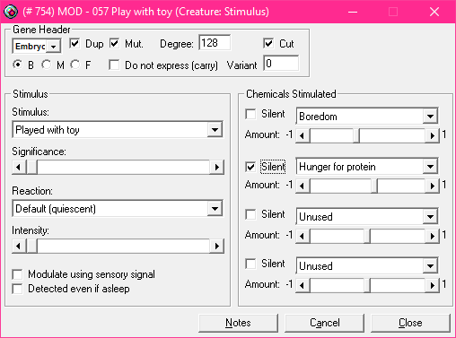](res/pic_gene_528_played_with_toy.png)  

Here, when the creature plays with a toy, the toy will fire off a CAOS event saying "I am a toy, this creature played with me", via `STIM WRIT`. The engine finds this gene on the creature, and triggers it.

In this example, "Boredom" is not marked silent, and IS a drive chemical:
- Boredom will be reduced by `0.2`.
- The resp lobe will flash `-0.2` for a frame.
- The neuron for `push toy` is likely active/susceptable.
- Any neurons connecting boredom to a susceptable neuron are enforced.
- So the denrite from "boredom -> push toy" is strengthened.

"Hunger for protein" IS marked silent, and it IS a drive chemical:
- Hunger for protein will be increased by `0.2`.
- The RESP lobe will NOT respond, because this chemical change marked is silent.
- No dendrites will be positively or negatively reinforced.

This is also normal: the engine does stuff like this all the time to consume resources like food, without teaching the norn that "this makes you hungry.

However some stimulus genes like "Activated button" simply do not cause that brief flash in the RESP lobe.
- Even on drive chemicals.
- Even with high significance.
- Even with different reactions + intensities.
- Even when modulated using a sensory signal.
- Even when marked non-silent.

That is to say, they *will* trigger, and they *will* produce the chemical changes, but they are not learnable events.  
We're also missing symmetrical events and instincts for going up/down (activate1/activate2) in lifts, which worsens things a bit.

As we've established, in default genomes, useful connections can be completely lost and migrate. Now on top of that we have an instinct which cannot be trained, meaning that if it is lost, it will (most likely) not come back and cannot be reinforced.

This is fixed in the Unlost genome, but we still don't have a way to reinforce instincts suggesting that "push button", "push lift" & "pull lift" might aid in reducing boredom & crowding. Only the initial instinct values.

Enter the `RES2` (Response 2) Lobe:

[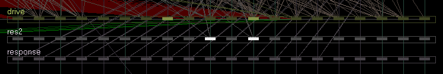](res/pic_lobes_res2.png)  

The RES2 lobe works a bit like the RESP lobe, but specifically for training "push button", "push elevator" and "pull elevator" vs boredom and crowding.

Though the layout is identical to the RESP lobe, only 2 drives are currently wired up:
- Crowding: Neuron #9
- Boredom: Neuron #11

This can be expanded to allow new, custom learning concepts.

This one gets a little complicated, and it's the one place I had to go against the "minimal chemical changes" ethos, but there's a strong, tangible payoff.

We add 3 new stimulus genes:
- Activated 1 (push)
- Activated 2 (pull)
- Deactivated

We can produce crowding/boredom relief from the new stims directly, but that would mean activating *anything* would reduce boredom or crowding. Even say pushing a lemon.  
 Instead we'll release a chemical that says "something which MIGHT reduce crowding has just happened", and "something which MIGHT reduce boredom just happened".  
 Afterwards we check if it was from a button or lift, and decide whether to train it and *actually* reduce crowding or boredom.

So, 4 new chemicals:  

**214:** `crowding_stim`: "Something which MIGHT reduce crowding just happened"  
**215:** `crowding_reducer`: "Yes, it was from a button or lift, reduce crowding"  

**216:** `boredom_stim`: "Something which MIGHT reduce boredom just happened"  
**217:** `boredom_reducer`: "Yes, it was from a button or lift, reduce crowding"  

Using RES2 is a bit like setting up instincts, but doing it with tracts instead.
I.e. connect "push button", "push lift", "pull lift" to the drive neuron in the RES2 lobe, such as crowding or boredom. 

With neuron #9 (crowding) for example:

- Check if chemical 214 `crowding_stim` is in the blood stream, from one of our new Activated1, Activated 2 or Deactivated Stimuli.
- If not, stop.
- Check if "push button", "push lift" or "pull lift" etc are susceptable in the COMB lobe.
- If not, stop.   
(Because the creature activated something else which we don't care about.)
- We now have both trigger conditions: this looks trainable.
- Simulate the real RESP lobe reducing crowding by e.g. 0.2 in the DRIV lobe.
- The DRIV->COMB dendrite spots this change.
- If there's a dendrite connecting "crowded" to a susceptable neuron, then train it.
- There is! "push button", or "pull lift", etc.
- Strengthen that connection.
- Finally:
- Release chem 215: `crowding_reducer`

So if chem 214 `crowding_stim` is released as a result of an unexpected action like"push lemon", then it will not be trainable, and crowding will not be reduced. Because we did not add a tract/dendrite to res2 for activating fruit.

Same thing for Boredom.

Why 2 chemicals per drive?

We need to use a neuroemitter to check if neuron #9 (crowding) or neuron #11 (boredom) in the new RES2 lobe is actually active and firing in response to a trainable event. Unfortunately, those neuroemitters don't let us do negative values, hence:
- 1 chem to detect if a trainable event MIGHT have happened
- 1 chem to reduce the drive if it was legitimately sourced from push button, pull elevator, etc.

If negative values were possible, we'd drop the 2nd chem and just reduce crowding/boredom directly.

See the Random Notes section for details on adding custom training events via RES2.


In addition to tweaked Activate1, Activate2, and Decativate genes, the Unlost Genome reintroduces many missing instincts and stims, especially regarding navigation. These Include:

```

Modified Stims + Insts:

- Retreat if Crowded (weak, low significance, deemphasized)
- I Retreat (weakened)
- Disappointment (no punishment, no boredom)
- I hit someone
- Just mated
- Play with toys
- Travelled in lift
- I have teleported
- Play with toy [0]
- Activate machine if bored
- Tickled by opposite sex (crowded++)
- It Approaches (boredom nulled, crowded++)
- I approach
- Crowded + Loneliness cancel (8:9 ratio) [1]
- Found Company (crowded++)
- I ate it (boredom nulled) [2]

New Instincts:

- Lift Up if Crowded (0.4)
- Lift Up if Bored (0.4)
- Lift Up if Low (0.4)
- Lift Up if Lonely (0.4)

- Lift Down if Crowded (0.4)
- Lift Down if Bored (0.4)
- Lift Down if High (0.4)
- Lift Down if Lonely (0.4)

- Call Lift if Crowded (0.1)
- Call Lift if Bored (0.1)
- Call Lift if High (0.1)
- Call Lift if Low (0.1)
- Call Lift if Lonely (0.1)

- Push Teleporter if Pain (0.27)
- Push Teleporter if Bored (0.36)
- Push Teleporter if Crowded (0.3)
- Push Teleporter if Lonely (0.3)

- Push Door if Crowded (0.3)
- Push Door if Lonely (0.3)

- Push Portal if Pain (0.3)
- Push Portal if Bored (0.1)
- Push Portal if Crowded (0.3)
- Push Portal if Lonely (0.3)

- DO NOT EAT CRITTER (hfp, hfc, hff, etc) (0.5) [3]
- Slapping Bad (0.12)

- Approach Norn Home if Lonely (0.68)
- Approach Norn Home if Bored (0.12)
- Approach Norn if Lonely (1.0)

Untrained Helper Insts (no stim) [4]

- Push Dispenser if Hunger for Prortein (0.1) [5]
- Push Dispenser if Hunger for Carbs (starch) (0.1)
- Push Dispenser if Hunger for Fat (0.1)

- Lift Up if Hunger for Protein (0.1)
- Lift Down if Hunger for Protein (0.1)
- Lift Up if Hunger For Fat (0.1)
- Lift Down if Hunger for Fat (0.1)
- Lift Up if Hunger for Carbs (0.1)
- Lift Down if Hunger for Carbs (0.1)

- Call Lift if Hunger for Protein (0.1)
- Call Lift if Hunger for Fat (0.1)
- Call Lift if Hunger for Carbs (0.1)

- Teleport if Hunger for Protein (0.1)
- Teleport if Hunger for Fat (0.1)
- Teleport if Hunger for Carbs (0.1)

[0] In the original genome "push machinery" has the same strength as "push toy".

[1] With this 8:9 ratio, creatures will *tend* to disperse in adolescence and youth. If you want your creatures to disperse a bit during childhood, then change this to 4:5.

[2] Creatures could otherwise remain pretty un-bored by eating all day. Dr Now would not approve.

[3] Bees are criters. Instadeath. Norns can't tell them apart from edible critters. Bad plan. Can't learn from death.

[4] These are essentially throwaway instincts. Not super necessary, but helpful to have. Not a problem if they migrate.

[5] Dispensers may contain food or they may contain toys. The creature has no way of knowing, so we can't rely on it.

```

There's a slight asymmetry to keep things moving, but they are balanced such that a newborn creature might:
- Have a slight urge to call a lift
- A bigger urge to actually USE the lift
- And a bigger urge to play with the toy at the top

The initial sleep time in the INST lobe has been adjusted to accomodate these changes.


# Problem #7: Tiredness vs Rest

There is a chemical: chemical 155 `sleepiness`.  
As expected, injecting this chemical makes a creature involuntarily `sleep`.

Then there is chemical 154: `tiredness`.  
This is more of a "take a `rest`" kind of chemical. Sit down, relax for a bit.

So far so sensible. But for some reason, when the norn is *sleepy* (as in, high sleep drive), the engine whispers "rest" into the VERB lobe.

But when the norn is *tired* (not sleepy, just needs a rest), the engine does *not* whisper "rest" into the VERB lobe.

This is one of the easiest fixes:
We add a tract from DRIV neuron #6 (tired) to VERB neuron #10 (rest).
This happens after the VERB lobe is filled, but before anything reads it, overriding whatever the engine suggested.

For such a small change, this is one of the most behaviourally significant changes, fixing issues with norns not resting, not sleeping, complaining about being tired, etc.

Creatures tend to rest for 2-3 seconds, then sleep it off, and bounce back.

# Problem #8: Familial interests

Baby creatures have no real urge to follow parents or siblings, who could teach them valuable skills.

Enter the `FMLY` (family) lobe:

[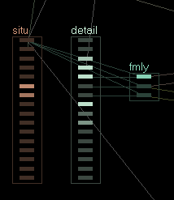](res/pic_lobes_fmly.png)  

The FMLY lobe sources the following:

From the DETL lobe:
- "it is my sibling"
- "it is my parent"
- "it is my child"

From the SITU lobe: 
- "i am this age"

Simply, in very young creatures, an urge to follow siblings and parents is whispered directly into the COMB lobe via the "approach norn" neuron. Weakly enough so as to not overpower food drives and navigation, but strong enough to be a feasable fallback if there's nothing else to do.

This is an asymmetric relationship with parents, as it makes more sense for a parent to go about their business, chattering away, leading their child to food, company, etc.
As creatures are poor multitaskers, making the parent follow back would cause both creautures to stare at eachother for prolonged periods in a detrimental way.

Additionally there is an `inbreeding inhibitor` tract.
Very simple: The 'friendly' neuron in the DRIV lobe is muted if the target is a parent or child.
Unfortunately, this had to be disabled for siblings, as any creatures with missing/null parentage are considered siblings by the engine (meaning you could not start a population).   
There may be workarounds, further research is needed.


# Problem #9: Crowding

We still haven't fixed that yet.

There is a "retreat" mechanic, but it has many issues:
- A single creature retreating in a crowd of 10 will reduce all creatures' crowding by 0.06.
- This is self sustaining and so one norn doing this every so often can un-crowd a whole group of norns very quickly.
- Kisspops/Tickles in crowd further reduce crowding.
- The act of retreating, will barely move a creature far from a crowd.
- Creatures will often return to the exact same crowd several seconds later.
- Approaching a creature reduces boredom, further reducing the need to leave.
- Loneliness and crowding cancel, which further reduces crowding at a constant rate.
- Retreating is quite dramatic, when "do something else" or "change focus" would suffice.
- They get FOMO and walk back several seconds later.

The aim is for loose clustering, but with a slight spread. I've been calling it clusterspread internally. Not an elegant term, but it works.

Enter the `CRWD` (crowding) lobe.

[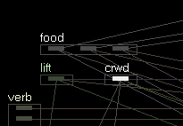](res/pic_lobes_crwd.png)  


The CRWD lobe sources input from various places:
- The raw `Crowdedness` chemical.
- `It is a creature` in the DETL lobe.
- `Friendly` in the DRIV lobe adds a small boost.
- The creature's `Life Stage` in the SITU lobe.

If all of the conditions are met, like the SUPR/FCUS lobes, the trigger timer starts counting up based on the strength of the above factors.  
Once it has latched (reached 1.0), it instantly mutes the following SUPR lobe categories:

```
✅ Inhibited
❌ Not inhibited

❌ 00 Self
❌ 01 Hand
❌ 02 Door
✅ 03 Seed
✅ 04 Plant
✅ 05 Weed
✅ 06 Leaf
✅ 07 Flower
✅ 08 Fruit
✅ 09 Manky
✅ 10 Detritus
✅ 11 Food
❌ 12 Button
✅ 13 Bug
✅ 14 Pest
✅ 15 Critter
✅ 16 Beast
✅ 17 Nest
✅ 18 Animal egg
✅ 19 Weather
✅ 20 Bad
✅ 21 Toy
✅ 22 Incubator
✅ 23 Dispenser
✅ 24 Tool
✅ 25 Potion
❌ 26 Elevator
❌ 27 Teleporter
✅ 28 Machinery
✅ 29 Creature Egg
❌ 30 Norn Home
❌ 31 Grendel Home
❌ 32 Ettin Home
✅ 33 Gadget
❌ 34 Portal
❌ 35 vehicle
✅ 36 Norn
✅ 37 Grendel
✅ 38 Ettin
✅ 39 Something
```

Encouraging creatures to go somewhere else and do something else.

While the CRWD lobe's influence could scale with age, all of the various crowding genes exist in a fragile balance. Instead once a creatures reaches adolescence, the CRWD lobe becomes active. When combined with the FMLY lobe, the following behaviours can be expected:

```
0: Baby: Follow parents and siblings.  
1: Childhood: Smell lobe activates, creatures may be enticed furhter afield.  
2: Adolescence: CRWD lobe allows wandering, experiencing the world.  
3: Youth: Creatures may breed, CRWD plays a larger role.  
```

Various genes affect crowding:
- Sleeping reduces 0.016
- Swearing removes 0.016
- Tickles (opposite sex) removes 0.08
- I retreat (briefly) removes 0.089
- It Retreats (briefly) removes 0.069

Basically a list of all of the things that happen in a norn pile, so not much incentive to leave.
These changes have already been covered in the section on inconsistent stimuli, but explain why the CRWD lobe is necessary where "retreat" falls short.


# Problem #10: Elevator dispersal

We've already touched on the idea that elevators, portals, teleporters, etc should be a means for dispersal, and that the engine lacks builtin solutions for very direct non-chemical 3-4 step processes.
This leads to norns seeking out elevators as a means of anti crowding, but getting caught up in a crowd of norns playing with them.

Enter the `LIFT` (elevator dispersal) lobe:

[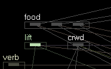](res/pic_lobes_lift.png)


The lift lobe sources inputs from:
- The `i am inside a vehicle` neuron in the SITU lobe
- The `crowded` neuron (raw drive level) in the DRIV lobe
- The `Elevator` neuron (signed distance) in the VISN lobe

As you'll expect by now, there's a trigger timer which counts up when conditions are met, and down when they are not. If it reaches `1.0`, it latches, and the LIFT lobe is active.

While it's active, the LIFT lobe writes either LEFT or RIGHT into the DECN lobe to walk away from the lift.
E.g. if left of centre, walk left, else walk right, using the VISN lobe's pos/neg distance as a basis.  

The SUPR lobe is then immediately latched for the following nouns:
- Norn
- Lift
- Button

> **Note**:  
 The LIFT lobe triggers both "retreat lift" in the COMB lobe and either "left" or "right in the DECN lobe. This produces some variety in their response to crowded lifts.
 
# Problem #11: Messy Dendrites & Disappointment

With all of the new lobes and tracts, the Brain In A Vat tool can become nearly unusable due to the sheer density of diagonal dendrite connections covering neurons.

Enter the `DISP` (dispersal) lobe  and `RTEx` (routing) tracts

[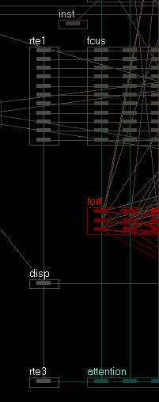](res/pic_lobes_disp.png)

The DISP lobe is intended to house various useful variables & signals, which are commonly used by other lobes. 

It then passes all 8 of its variables through the `RTE0`, `RTE1`, `RTE2`, and `RTE3` tracts.
These RTEx lobes & tracts exist purely for routing purposes, to keep mess down.

They all source the same variables from the DISP lobe, things like:
- creature's age
- did the disappointment chem just spike?
- is the norn asleep

All 8 vars are then routed as so:

- DISP -> RTE0 -> SUPR
- DISP -> RTE1 -> FCUS
- DISP -> RTE2 -> RES2
- DISP -> RTE3 -> ATTN

This aligns dendrite connections to a managable grid.   
SUPR, FCUS, RES2 and ATTN don't actually use all of the variables, but can use any of them if required.

One of the signals DISP handles is disappointment spikes, which are calculated by the lobe itself. Thus 3 of the varables include:
- Current disappointment value.
- Previous disappointment value.
- Did disappointment just spike from 0 to something nonzero.

The actual variable usage/numbering is documented int the .GNO file.

> **Note**:  
RTE0 and RTE1 are currently disabled, and may be  removed in future versions to reduce the genome size.

# Problem #12: Phantom smells.

Either due to minor mapping mistakes or engine bugs, it is quite common for particlar rooms in a metaroom to emit one or more phantom smells. E.g. it will smell like "seed" but there are no seeds present.

Some examples:

- In C1inDS, room `1218` (to the right of the piano) emits a phantom "food" smell.
- In C1inDS, rooms `1119`, `1081` and `1102` (under the incubator) *sometimes* emit phantom "food", "seed", "norn home", "grendel home" and "ettin home" smells.
- In C2toDS, the desert area above the incubator (especially near the jetty) emits phantom "seed" smells.

While it is likely that a room emitting a single phantom smell is just a little mapping error, or intended as some sort of navigation waypoint, the second example (rooms, 1119, 1081 and 1102) is likely an engine bug. This one doesn't happen in every world, but often happens after several hours, and includes "grendel home" and "ettin home".

Single phantom smells are easy to deal with (FCUS & SUPR catch them), but multiple smells are a bit more destructive. 
Since FCUS and SUPR require the norn's attention to focused on a particular noun (smell/vision/etc), the creature ends up just switching back and forth between the smells as each one is inhibited, never quite escaping. The hungrier a creature is, the less likely they are to use e.g. a lift, button or vehicle to escape.

The solution for this is to mute smells after a while if the object never becomes visible:  
"I can only smell something for so long without actually seeing it".

Similar to the FCUS and SUPR lobes, there is a counter which ticks up to 1.0 for all smells. If the smell does not become visible after a short while, it is completely muted for ~30 seconds.    
Unlike FCUS and SUPR, this is passive and doesn't require the creature to focus on the smell.  
If/When the smell becomes visible, the existing `Smell <> Vision equaliser` tract resets the SMEL lobe's counter.

"I can only smell something without seeing it for so long".

Currently the following neurons are wired, since they are the most disruptive:
- #3 Seed
- #8 Fruit
- #11 Food

Perhaps the default engine behaviour of enabling SMEL at childhood is there to cover this bug up to some extent. Older norns may have stronger drives to use lifts and buttons to escape, and so struggle less. In testing older norns were much less affected, but not immune.

Unknown if this issue exists in the stock C3/DS areas.

# Problem #13: More broken stims and hidden engine behaviour.

The stimulus gene for "Reached CA Smell 15" (Chem 180: Norn Home) doesn't work as advertised.
The gene is *supposed* to modify:
- 162:Comfort (Homesickness) - 1.0
- 159:Boredom -0.04

In reality the engine silently removes all Chem 162 (Comfort/Homesickness) when the creature reaches the smell.
No chemicals the user specifies in the gene are ever emitted.

Enter the `HOME` lobe:  
[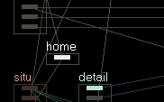](res/pic_lobes_home.png)

This one though may have been a last minute deliberate tweak on the part of Cyberlife/Gameware though:

If you consider the norn home smell a gradient from 1.0 (directly in front of) to 0.0 (as far away as possible), the engine doesn't set a hard coded single threshold point, like "creature was < 0.75 and is now >= 0.75, it is now home".

Instead the creature may have been sitting around the 0.75 mark for a while. If it gets significantly closer, say 0.80, then homesickness is silently set to zero in the bloodstream, even if the responsible gene is disabled. 
Now if the creature has been at 0.80 for a while and walks to say 0.88 on the gradient, it will trigger again.

So rather than a single activation point, the engine detects "creature was quite close and got closer". My hunch here is that this is to prevent creatures becoming obsessed with returning home, but being unable to do so, due the very basic pathing, or there being a blocked path, etc.

The only reliable detection method I've found is to check when the Homesickness chemical drops from something relatively high (say > 0.11) immediately to zero, while the creature is not sleeping.

The home lobe takes one other input from the SITU lobe: "I'm carrying something".  
This, for ettins, is presumed to be a creature egg.

When the creature reaches home, the lobe flashes allowing various behaviours, including training via the RES2 lobe to re-enable creatures learning from reaching the Norn Home.

# Ettin Tweaks:

These ettins are 99% norn, but with ettin-like behaviours:
- their home is now the norn home (C1InDS)
- less crowd tolerance
- instead of picking up gadgets, they love to hoard creature eggs at the norn home.
- the Unlost ettins and norns have complementary genes to help tolerate eachother, enjoy eachothers' company, coexist, and interbreed.

Certain genes are prefixed to help determine which species they are intended for:

- `(n)`: For norns
- `(e)`: For ettins
- `(a)`: This tract/lobe checks for the presence of Ettin Nitrate, and changes behaviour accordingly.

One example of an automatic tract is `SITU->CRWD`:
- In norns, crowding doesn't happen until the third life stage: Adolescence.
- In ettins, crowding can happen from birth.


# Other Misc Tweaks

### The FOOD Lobe:

What if something goes wrong with feeding instincts?

Enter the `FOOD` (food) lobe:

[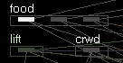](res/pic_lobes_food.png)

Originally, this lobe was an early attempt at helping senile norns to continue eating. It became a non-issue after fixing senility, but has been kept as a redundancy.

If a creature is hungry, and there is *visible* (not smellable) food nearby, then the relevant neurons for "eat seed", "eat food" etc are directly stimulated in the COMB lobe.

I.e. As in nature, no healthy organism, unless suffering from some sort of physical or mental reason, or stronger drive will *generally* sit, hungry, next to a pile of food and not eat it. 

> **Note:**  
The lobe as also intended as a fallback for norns cross bred with the default genomes, as a safety precaution. While it is *now* known that mixing these genomes is a bad idea, a workaround may be found in the future, in which case the lobe's secondary purpose is still valid.

# Running out of dendrites!

All of the new instincts caused a serious lack of dendrites in the DRIV->COMB lobe.

Tracts have a "connections per neuron" value. For migratory tracts, the source is generally nonzero, and the destination should be set to 0.
(Though, from experimentation, it does work the other way).

That said, whichever value is nonzero actually governs the maximum number of dendrites connecting **to** a neuron in the COMB lobe, *and* **from** a neuron the DRIV lobe.

For example, if you set the maximum value to 4:

- If you had one dendrite from each of the DRIV neurons to the same, single neuron in the COMB lobe, only 4 of those would be valid. The maximum would need to be at least 20.

- If you had one dendrite from each of the COMB neurons to the same single neuron in the DRIV lobe, only 4 of those would be valid. The maximum would need to be at least 440.

So 2 changes were made:

Default:
```
Source (driv):
  Connections Per Neuron: 4
Dest (comb):
  Connections per Neuron: 0

✅ Dendrites migrate and are initialised randomly
❌ Dendrites do not migrate and are initialised in order

❌ No of connections per neuron is random up to specified maximum
✅ No of connections per neuron is exactly as specified
```

New:
```
Source (driv):
  Connections Per Neuron: 12
Dest (comb):
  Connections per Neuron: 0

✅ Dendrites migrate and are initialised randomly
❌ Dendrites do not migrate and are initialised in order

✅ No of connections per neuron is random up to specified maximum
❌ No of connections per neuron is exactly as specified
```

- The max number of dendrites has been increased to 12.
- Connections are now random up to a max, to prevent the creature being born with `12 connections` x `20 driv neurons` = `240 dendrites`.  
Instead, they're assigned as required.

I had at one point tried creating a second DRIV->COMB tract, where each tract got half of the DRIV lobe and half of the COMB lobe. This proved less effective and less stable than just increasing the max dendrite count.

### Pointless Enforcable Events:

There's no positive outcome from a norn learning something like "i'm hungry, look at a grendel" or "i'm tired, express lift".

When they perform an action, looking is automatic.
When they sleep, it's involuntary.
When they express, it's involuntary.

So DRIV->COMB is now only connected to:

```
❌ 000-039: Look
✅ 040-079: Push
✅ 080-119: Get
✅ 120-159: Drop
✅ 160-199: Eat
✅ 200-239: Pull
✅ 240-279: Approach
✅ 280-319: Hit
❌ 320-359: Retreat
❌ 360-399: Express
❌ 400-439: Rest
```

Which also saves a lot of dendrite connections, meaning 12 dendrites per neuron goes further than it would otherwise.

> **Note:**  
It might be worth restoring "Retreat" in the future, but in the current state, where we have the CRWD lobe, and the instinct to retreat (albeit, missing the stim to train it), creatures cope well without it.


### Variable DRIV->COMB influence

In the DRIV->COMB update tract, when determining how much influence the tract has (where the weight is multiplied by the target neuron's existing Var1/Input value) there is now a global weight setting.

The DRIV lobe's `Init` rule now loads the value `0.5` and stores it in `Var1/Output` (A previously unused variable).

This value can be changed per DRIV neuron to adjust how pressing any given drive is in relation to others.

This changes DRIV->COMB.Update:
```
Line 3: div by add to neuron input | value | 0.51
```

to

```
Line 3: div by add to neuron input | input neuron | output
```

### Preblanking:

It is common for the default brain lobes to:
- Get their input from various dendrites.
- Run their own update.
- Blank the input at the end, ready for the next frame.

Or:
- Rely on one tract writing an input value: "STORE in neuron input"
- Writes from other lobes *must* happen after this one: "ADD AND STORE in neuron input"

This works, but means you always see a blank value for Input in the Vat tool, since it shows the end-of-frame value.

Some tracts were added to blank inputs on Slot 1 instead, for various lobes:
- `PRECOMB` for `COMB`
- `PRESUPR` for `SUPR`
- `PRECRWD` for `CRWD`
- `PREATTN` for `ATTN`
- `PRERES2` for `RES2`

So:
- Slot 1 runs, those lobes have their inputs cleared.
- They get their inputs from various dendrites.
- They run their own updates (Somewhere after Slot 1).
- At the end of the frame, you can see/debug the value in the Vat tool.

This also means that with the SUPR & FCUS lobes for example, any other lobe may (optionally) contribute input between slot 1 and *whenever SUPR/FCUS udpates*.  

E.g. the CRWD and LIFT lobes *may* decide to contribute to inhibitors, but may not, but don't have to worry about writing over eachothers' values.

### Running out of slots:

The genome supports ~20 update slots.

So for example if a couple of lobes feed into eachother:  
`VISN -> STIM -> COMB -> ATTN`

Then VISN would have to have the lowest value, STIM a bit higher than that, COMB a bit higher than that, and ATTN a bit higher than that.

So obviously I ran out of slots qucikly.

Workaround 1: Stacking Shared Slots  
If VISN and SMEL both write into the STIM lobe, then VISN and SMELL can both be in slot 1, with STIM being slot 2 or higher.

Workaround 2: Gene Order Matters:  
You can, to some extent, get away with putting several things in the one slot, but it is heavily dependant on the order in which the genes are defined in the genome.

So for example: `VISN -> STIM -> COMB -> ATTN`  could share a gene slot if they were declared in that order in the genome, but if you rearranged them, then some lobes would be reading values from the *previous* update.

This applies to both lobes and tracts.

As such, the Unlost genome does sometimes rely on genes being in a specific order. Where this is the case they're usually labeled "slot 12a", "slot 12b", "slot 12c" etc.  
Take care if rearranging, as it is a tedious and error prone procedure.

There is also a hard limit on how many genes you can stack in the same slot. The exact number is unknown, but does mean some groups of neurons must be in Slot 1, Slot2, Slot3, Slot4, etc.

Generally speaking though, there is a gap of 1 between important lobes to allow both:

A normal connection like
```
Slot 1: Source Lobe
Slot 2: Source->Dest Tract
Slot 3: Dest Lobe
```

But also hijacking/intercepting the tract inbetween like:
```
Slot 1: Source Lobe
Slot 2: Source->Intercept Tract
Slot 2: Intercept Lobe
Slot 2: Intercept->Dest Lobe
Slot 3: Dest Lobe
```

In this case, the Slot 2 genes would have to be defined in the order above. Unfortunately necessary, and very common in the Unlost genome, so all new genes are grouped with headers, and tracts/lobes have their slot numbering in the captions.

# Wrap up:

There we go, all in all, about 198 new genes, 10 new lobes and I'm not counting the new instincts, stims, and tracts.

Not perfect, but it's absolutely night and day vs the base genome.

The Unlost Genome will not out breed a screaming cluster of normal norns, but they will, in every case, out survive, out smart, and outlive them, living happier, more fulfilling lives in general.

After checking various 30+ hour old creatures, I'm pleased to say their brains look squeaky clean, highly optimised with few (if any) superfluous dendrite connections. They stay happy, functional, mobile, and active.


# Random Notes & Findings:

### The SVRule System

https://creatures.wiki/Brain#A_note_from_the_programmer

To paraphrase: Steve Grand / DigitalGod made the SVRule system since it could be safely mutated and still produce valid (but possibly useless, possibly helpful) variations. I.e. exactly the sort of thing you can't do with a line of C/C++, as that would lead to syntax errors, memory issues, crashing, etc.

That was the theory anyway, and a cool idea. But in practice, the SVRule system was never used in this way. All of the shipped genomes mark the various brain genes as immutable (not mutatable).

Manually mutating them (essentially fuzzing the engine) produces all sorts of errors & crashes, and has creatures speaking semi random looking error strings. I haven't looked into it in any real depth, but given that the engine will usually crash soon after, it looks like maybe some of the invalid state rules can read/write out of bounds.

I get the impression that the intention was initially to allow these brain mutations, but given that a single bad mutation in any of the hundreds of lines could trash a norn's ability to function (i.e. masively upping the chances of bad mutations), it was likely disabled early on and the system was never properly range/bound checked.
Shame. As per, there's so much ambition hidden just under the surface.

### "Something"

Neuron 39 in the noun lobes is marked "something".   
https://creatures.wiki/Noun_lobe

The creatures wiki and other sources say "something (geat)" or "reportedly geat". Again, I think that was likely the original intention, but adding a tract which perma-blanks this one neuron produces interesting results.  

Normally, when a creature says "eem hungry", others might reply:  
`maybe eat something eem`  
With "something" being #39.

If you blank neuron 39 (something/geat), instead they will reply:  
`maybe eat ettin, eem`  
With ettin being #38.

Blank ettin, and they'll say  
`maybe eat grendel, eem`  
With grendel being #37.

It looks a lot like the engine does a hidden pass of a norn's brain when it hears another express.
E.g.:
- Set the inputs in the listener's brain to something similar to the expresser's brain.
- Run a pass of the listener's brain with these inputs.
- Grab outputs.
- Restore the listener's brain..

My hunch here is that all inputs are biased with a small, nominal start value, and the highest output wins. But if they all match, the last nonzero value is chosen (usually #39, "something). 

When a creature is urged to perform a semi-valid noun/verb pair like "right weather" when there is no weather nearby, the norn will still walk to the right, suggesting that norns can replace the verb with something more plausible.  
Perhaps at some point norns were suggesting `maybe right geat, eem`, with listeners substituting "geat" for a nearby object, which lead the developers to simply rename "geat" to "something".

### "Definitely":

We know creatures might say `maybe eat something, eem`, but depending on the strength to the ATTN lobe, they might also say `definitely eat something, eem`.

This is pretty easy to accomplish: make a tract which takes the highest value in the ATTN lobe, and boosts it to 1.0. Now your creatures will be far more decisive.
Unknown if the "definitely" response is more persuasive to listeners.

### Reading/Writing urges with URGEncy tool or CAOS

https://www.ghostfishe.net/bbw/tutorials/categorical.html

The following CAOS will Urge a creature to repeat an action:  
`targ norn urge writ targ {nounInt} {forceFloat} {verbInt} {forceFloat}`

Which can be read back with something like:  

```
  targ norn
  outs ""FOCUS""
  outs "",""
  outv decn
  outs "",""
  outv attn
```

While the neurons for "get" and "seed" may be active in COMB, ATTN and DECN, the urgency tool will read "approach seed" until the creature has walked close enough to the target.

Additionally, writing urges *in*, telling the creature to move "left" or "right" works perfectly.
However when reading back, the verb may sometimes be "rest".
Unknown if this is just a quirk, a potential navigation issue, or similar to the "approach" mechanism.

### NeuroEmitters vs Chemical Emitter

NeuroEmitter genes are typically set up like:
`Tissue 66: INST` -> `IT IS ID <X>` -> `Inject <some chemical>`

While Chemical Emitter genes are:
`Tissue 66: INST -> Neuron X Var Y` -> `Inject <some chemical>`

Curiously both types can be used to read the single neuron in the INST lobe in the engine.exe community build, but on the GOG version (regular release build) `IT IS ID <X>` does not.

Easy fix: use "Chemical Emitter" instead of "NeuroEmitter", but interesting either way.

### Stumbling animations:

To better differentiate between similar drive levels, squared drive levels were tested to prevent better-trained, but less-pressing drives constantly winning.

E.g. in the DRIV lobe's update:  
`state = state * state`

While successful, it does worsen a strange bug where norns will not be able to approach targets.
This occurs in about 1 in 20 creatures by the 20 minute mark, and 1 in 6 by the 40 minute mark.
They will generally be able to:

- Stumble left, but not walk right due to an interrupted animation.
- Stumble right, but not walk left due to an interrupted animation.

Other less common variants include not being able to walk in either direction, or walking a few more frames then stopping to stare at the camera at the same point during each walk cycle.

Various solutions were attempted including tweaking the VERB->DECN left/right levels, but ultimately, given the potential to introduce exciting new bugs, and how debilitating the issue is, the idea has been shelved.

Additionally, various DRIV/DRIV->COMB/COMB errors can contribute to this, one being forgetting to clear COMB's input every frame.

Overall though, I'm not sure at all.
Often it seems to be from the first batch of norns injected into a new world, then clears up.
Further research required.

### DRIV->COMB Relaxation Rates:

The default `short term relax rate` and `long term relax rate` values are `0.0032` and `0.0004` respectively.

While larger values (e.g. multiply both by 10) work very well, and reinforce learning more quickly, ultimately it was decided that it would be safer to leave them as-is.  
The reasoning being that if the existing values, work well enough to ship, even with known reinforcement issues, then these values may provide some level of protection against unforseen issues.

### "Tickled by opposite sex" vs "Just mated" stimulus genes:

Interestingly, these stimuli do not appear to be applied equially to male and female norns.

The following situation does NOT produce groups of same-sex creatures:  
`Just mated`: Make no changes to "crowded" chemical.  
`Tickled by opposite sex`: Add 0.1-0.2 "crowded" chemical.  

But the following situation does produce little clusters of same-sex creatures:  
`Just mated`: Add 0.1-0.2 "crowded" chemical.  
`Tickled by opposite sex`: Make no changes to "crowded" chemical.  

Suggesting that there may be some difference in application.

In practice though, if the values are balanced, these groups will attract each other and disperse over time, producing small, transient clusters, while maintaining an overall spread. This applies too to female norns returning home to lay eggs. There's an oscillating convergence and divergence.

Further research maybe interesting, but isn't pressing.

### SVRule instruction specificity:

This is not important, but feels like a fun little piece of digital archaeology.

The initial few SVRule instructions are super basic, like:
- Load
- Store
- Add
- Subtract
- If > 0
- If < 0

However, scrolling down the list, it's interesting to see where instructions were combined for convenience:

E.g. instead of:
```
load from | value | 0.1
add | neuron | value
store in | neuron | value
```

Later instructions allow:
```
load from | value | 0.1
add and store in | neuron | value
```

And instead of:
```
load from | neuron | input
if > | value | 0
stop
do something else
```

Later instructions allow:
```
stop if > 0 | neuron | input
```

With my favourite being:
```
load from | neuron | output
div by | value | 0.5
add | input neuron | input
store in | input neuron | input
```

Which can be replaced with:
```
div by, add to neuron input | neuron | output`
```

And then there's the `tend to`, `tend rate`, `long term relax rate` and `short term relax rate` instructions, which provide completely hidden vars and run calcs in native code to take the burden off the SV Rules.

Not terribly important to know, but fun to see.

### Duplicated Stimuli

It is possible to have 2 stimuli for e.g. "played with toy", but only the first one, or the one with the highest significance will fire.

It means there is a hard limit of 4 chemical outcomes (unless you add some sort of chemical repeater like the RES2 lobe), but it does also mean that you can add a second stim, with higher significance, which activates only in childhood, adulthood, etc.


### The DRIV->COMB Tract:

The DRIV->COMB tract's `Init` rule has been repurposed to tick every frame. Essentially giving DRIV->COMB dendrites 2 full update cycles.  

- The `Init` part handles tickles/slaps
- The `Update` part handles learning via the RESP/DRIV path

This gives us a total of 2x16 = 32 instructions to cover the entirity of learning. Given this limitation, and the previous section on SVRule specificity, I had reasonably assumed the DRIV->COMB tract would be quite tight for instruction space, but apparently not.

The first three instructions in DRIV->COMB.Init are:
```
ShortTerm Relax Rate | one
if zero | chemical | Pre-REM 
ShortTerm Relax Rate | value / 10 | 0.032
```

Essentially `set the short term relax rate to 0.032 unless chemical 212: PRE-REM is present`.

The thing is, chem 212: PRE-REM isn't used anywhere else. It looks a lot like a debug chemical used to speed up the relaxation of dendrite weight and strength. Yet here it is.

In every DRIV->COMB update in basically every creature ever, the first 2 instructions are kinda superfluous, unless some mutated gene randomly produces chemical 212.

### Stimulus Responses

The Genetics Kit is worded like

```
Stimulus: I've retreated
Significance: 0

Reaction: Default (quiescent)
Intensity: 0

Chemicals Stimulated: various
```

Suggesting that the chemicals are only stimulated if the creature performs *that* reaction to the stimulus. This is not the case.
The reaction, depending on intensity may be used to *force* the creature to perform an action.

E.g.
```
Stimulus: I've retreated
Significance: 1

Reaction: Retreat
Intensity: 1

Chemicals Stimulated: various
```

With this setup, if a creature retreats, it will retreat in response to that, and retreat in response to that, and then retreat in response to that, and then retreat in response to that.

But unfortunately, setting the reaction to "rest" after a creature has teleported for example, does not work!

The stims also seem to assume that various actions are temporarlly equal. E.g. That a 2-5 second retreat animation is enough to clear a huge crowd. Which it isn't.


### Up/Down drive is inconsistent

Sometimes the the Up and Down drives are blank and do not correspond at all to the actual chemical values. It doesn't seem to be a problem.

When they do activate, they also blank out other drive values.
Disabling the responsible tracts doesn't appear to do any obvious harm, but they were left in place in case they do fix subtle, unknown, or time-dependant issues.

### Vat tool patch

It can be frustrating monitoring dendrites in the Vat tool, since "play on loop" ticks over at about 1 frame per second on the Unlost brains.

I version 1.10.2 you can open the .exe in a hex editor and go to:

`0xFBFBAF`  
or search for  
```65 78 65 63 75 74 65 0A 44 42 47 3A 20 50 41 57```

That's `execute\nDBG: PAWS` with a newline in the middle:

Replace the newline `0x0A` with a `0x00`.  
Remember to make a backup.

Now when you connect to creatures you can open as many dendrite or neuron monitor windows as you want. While the play button is active the values will update. If you hit stop, the game will run at full speed. 

This means you can check on values by hitting play, then return to normal speed without disconnecting and closing all of your sub-windows for neurons, etc. To re-check the values, just hit play again.

Game changer.

### Random isn't that random

If you open the Vat tool and watch a creature during its first sleep, you'll see the random dendrite connections being made.

Strangely, neuron 163: "eat seed" is always trained a couple of ticks after neuron 0: "look self".

Could either be very-pseudo pseudorandom or deterministically buggy.

### DRIV->COMB again:

https://www.ghostfishe.net/bbw/tutorials/categorical.html

The engine defines a setting:  
`engine_synchronous_learning`  

with the description:  
> By default learning is asynchronous, so the creature learns from all STIMs. Set to 1 to make the creatures learn only from STIMs caused by the action they are thinking about carried out by the agent their attention is on.

In a world with more than 340 noun/verb pairs, the idea of fuzzy learning makes more sense.
E.g. negative reinforcement from eating bees in an area with bees and food sort of makes sense if you can focus on more than one thing at once. Having no specific stimulus genes here might work.

Or if you spend a lot of time around a dispenser, food neurons will be recently active, so cross training *in this situation* can make sense; food and dispensers are correlated. But not in every situation; other areas may have different outcomes, and creatures can't make high level decisions about their current area.

Vibes wise, Creatures has always felt a bit like a carefully curated balance of less-than-perfect, slightly-glitchy, but totally-viable fuzzy conditions producing emergent, lifelike behaviours, rather than a clean, clinical simulation.

Just a hunch, but everything about this engine screams to me that this was originally the intention, rather than a rigid set of stimulus genes.

### Chemical changes can take a while to filter through

Using an SVRule to check for chemical changes comes with some serious lag.

For example if you inject a chemical which disperses in 4 ticks, the biochemistry set will show that the chemical has vanished before the brain sees the changes. Since the brain only updates on every 4th tick, that means it can be *at least* 8 ticks before the brain sees a chemical change. If the tract depends on a lobe higher up in the slot list, that could mean waiting until the *next* update as well.  
 In this case 12 or more ticks.

E.g. the following tick sequence is plausible, with a little variation:
```
1: inject chemical
2: chemical present \
3: chemical present  \__ the initial chemical spike
4: chemical present  /
5: chemical present /
6: chemical not present
7: brain sees old chemical value   \
8: brain sees old chemical value    \__ brain seeing the spike
9: brain sees old chemical value    /
10: brain sees old chemical value  /
11: brain has caught up
```

Given that the brain runs at 20 fps, this can be more than half a second of wall clock time.

The reward chemical takes slightly longer than 4 ticks (1 brian update) to clear, it may be worth investigating if shortening that to 4 helps with corss-training issues.
Using a neuroemitter can in some cases speed things up, and for chemicals like REM (sleeping) you can get a *rough* gauge by summing all of the DRIV neuron values and checking if they're zero.

Beyond the previously-discussed DRIV->COMB issues, it is unknown if this affects other genes in unintended messy ways. E.g. crossing analogue/digital domains where some signals are essentially binary and some are gradient.

### Increased Incidence of Immortality

I've noticed a higher than average incidence of older or extremely old norns amongst the Unlost genome.

While it is possible for mutations to violate various natural laws and allow a norn to produce its own energy sources without eating, the more common flavours of immortality include but are not limited to:

- Norn does not age at all. Remains a baby forever. Will survive indefinitely if they continue to eat.
- Norn ages very slowly. Will survive exceptionally long if they continue to eat.
- Norn ages to a specific life stage then stops. Will survive indefinitely if they continue to eat.

At this point my best guess is that it's just a numbers game when it comes to those last 3 types of immortality.

If the norn remains bright, mentally alert and mobile into old age, then it will continue to eat, learn, contribute to the learning of baby norns, and possibly breed.

But if a norn with the same mutation becomes senile, stops eating, stops interacting & stops breeding, the same mutation is far less likely to be passed on.

### Adding custom learning events

Possible via the RES2 lobe.

Here's a high level overview. In practice, look at the new genes for exact variables and slot orderings.

To add something like a thirst drive, you could add an extra neuron to both the DRIV and RES2 lobes.

Then add a tract/dendrite from "eat potion" to the new neuron, so we know what the source of the event was. (By reading the neuron's susceptability)

Then add a custom chemical `thirst_stim` to the "i ate something" stimulus.

Add a chemical receptor to the your new thirst DRIV neuron, which checks that `thirst_stim` just happened.

RES2 will check that:
- The `thirst_stim` is present.
- The source is `eat potion`.  
And light up if both are true.

Add a neuro emitter which releases `thirst_reducer` when this neuron is nonzero.

And finally make a chemical reaction: 
```
1x `thirst_reducer` + 1x `<your thirst chem>` = Nothing
```
Which will remove the `thirst_reducer` from the blood stream, and actually reduce `thirst`.

It should in theory even be possible to learn from neurons other than those in the COMB and DRIV lobes. E.g. to mix in the SITU lobe's "i am in a vehicle", "it is my sibling", "it is my parent", "it is my child, etc.


### FORF

I haven't covered the FORF lobe at all, and have barely touched it.
I have observed it connecting to random neurons like "push lift" though.
Unknown if this is problematic, by design, or an engine limitation that solves itself over time.
That said, it will always eventually connect to norn-related neurons in a world full of norns.

# Known Issues / TODOs:

### Gene Loom:

Amazing tool, but it thinks the Unlost genomes are too big.  
It can still be used to compare genomes though, even if it can't save them.  
Worth checking if this is an easy patch at some point.

### Wander drive:

Rather than a complex system of interdependant lobes simulating wandering/exploration by reducing focus on specific things, it would be nice (or at least interesting) to have a single drive to encourage wandering or seeking out new things.

### Nav drive:

The DRIV neurons for WAIT, UP, and DOWN, when active, mute the rest of the DRIV lobe.
This could include very pressing drives like hunger or sleepiness.

Suspected but unconfirmed that this can lead to wall bonking and other repetitive behaviours but muting genuinely pressing drives. At least once I have observed these drives appearing to be "stuck".


# Uneasy Truths:

### Baby norns don't learn
We covered this. Have them sleep to create dendrite connections.

### Reward/Punishment
You're rolling the dice every time you punish a norn. Reward is less problematic, but punishment could easily untrain the wrong thing (Basically anything the norn has recently thought about).

### Senility
As mentioned a senile norn (default genomes) will have a collection of semi-useless dendrite connections which dominate any remaining useful ones. It may well be possible to simply slap a norn out of it, let them nap, and hope beneficial new pathways are made. But I don't feel right doing that. I'm not going to try it.

It is *very likely* possible to fix existing senility entirely via CAOS though:
- Unweight *all* of the DRIV->COMB dendrites  
(The same commands the Vat tool uses, but batched).
- Re-add them to the instinct queue via CAOS.
- Run `targ norn drea 1` to make the norn dream.
- Wait for `targ norn outv ins#` to reach 0.
- Run `targ norn drea 0` to wake the norn back up.

### The brain does not evolve

Covered in the section on "The SVRule System".
The brain itself and its SVRules do not mutate, and manually mutating can cause crashes.
It would have been great to see what would have happened in 20 years if this was doable.

# Questions:

### Can I use this genome in my proje...

Omg yes.

### Can I mix them with my normal norns?

Nah don't.  

It's possible, I've managed once or twice, and put a lot of effort into it, but the engine isn't great at matching the differences between original and Unlost genomes.

Hybrid offspring can be born:
- With a full default brain.
- With a fully Unlost brain.
- With a non-functional mix.
- With a semi-functional mix.
Or most devastating:
- With only one or two brain lobes total.

Not really worth it.

### Is this based on CFE/CFF/2017?

No, not at all.

I think the only common change might be Gene 262: "Painly hunger for protein overwhelmsion - Reaction" which looks like an obvious mistake in the original genomes. It turns "Pain" into "Hunger for Protein Backup" instead of "Hunger For Protein" into "Hunger for Protein Backup"

I wanted the Unlost genome to be more of a base, on which other genomes can be built. CFE/CFF/2017 already contain a *ton* of great fixes for common issues and I didn't fancy trying to support a pile of chemical changes that honestly, I don't really understand.

Last minute note:
The CFE/CFF/2017 genomes have an ELVN lobe, which works like the VISN lobe, except that it gives vertical distance, not horizontal. My engine has no reference to this lobe and so doesn't fill the values in.
Does this require a specific engine version, or a script to fill in the values?
Would love to know, cheers.


### How's the performance?

It's fine.  
Modern machines, 36 norns, 1000fps in Docking Station.


# Credits / Thanks

- Cyberlife/Gameware for the original genomes
- Everyone involved in any part of C1inDS
- Everyone involved in any part of C2toDS
- Everyone at the [Creatures Wiki](https://creatures.wiki/Brain), big fan
- Everyone at [CreaturesCaves](http://creaturescaves.com/)
- Everyone involved in CFE/CFF/2017 norns and everyone who tested
- Geat_Masta
- Arnout
- Evolnemesis
- Malkin
- [Breedstorage.com Authors](https://web.archive.org/web/20250518200435/https://c2tods.breedstorage.com/)
- [lisdude.com](https://lisdude.com/Creatures/Community/C3/), for Gene LOOM, Community Engine Builds & the updated Vat tool!
- [Chris Double / double.nz](https://double.nz/creatures/genetics/svrules.htm)
- [ghostfishe.net](https://www.ghostfishe.net/bbw/tutorials/categorical.html)
- [DiscoverAlbia.com](https://discoveralbia.com/2011/07/stumbling-across-dendrite-migration-in-creatures-1.html)
- [CreaturesHeaven.nl (via the wayback machine)](https://web.archive.org/web/20160401000000*/http://creatures.virtualheaven.nl/)
- [EemFoo's archive](https://eem.foo/archive/)
- [Uni of Sussex for still hosting their old research papers :D](https://www.sussex.ac.uk/informatics/cogslib/reports/csrp/csrp434.pdf)
- https://dendrit.tuke.sk/~newalife/kapitola/41/
- [Exploring the Ark](https://exploringtheark.livejournal.com/6122.html)

Please shoot me an @ if I've missed anyone!  
Thanks to everyone in the creatures community for allof their hard work and documentation.

Much love to all.

